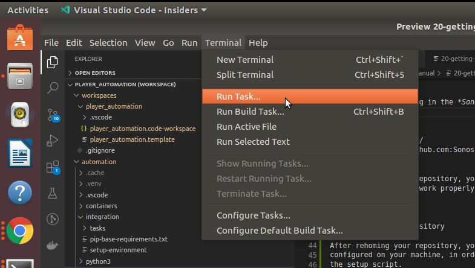
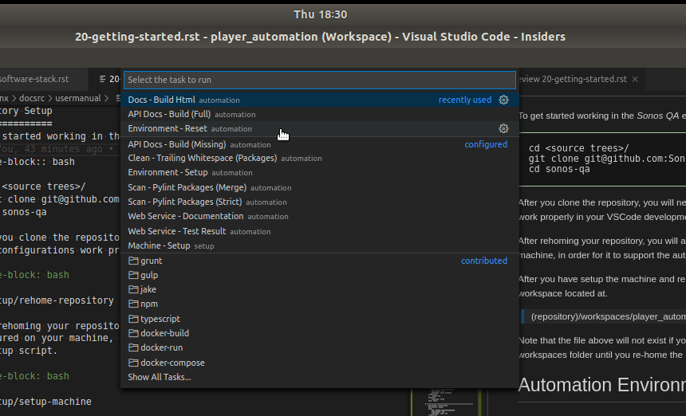

.. _02-00-getting-started:

***************
Getting Started
***************

Preliminary Setup
=================
Before attempting to use the repository you will need to setup your development environment and machine.

Install VSCode
--------------
*Visual Studio Code* is a cross platform developement environment that supports multiple languages and multiple operating systems.  The
*Mojo Automation Kit* workflows are optimized to work with Visual Studio Code.  It could also work with other development environment such
as PyCharm, however, *Visual Studio Code* is the least expensive and most versitile option.

*Visual Studio Code* is an extensible development environment meaning it allows you to extend its functionality throught the addition of
*Plug-Ins*.  The plug-in system of *Visual Studio Code* allows you to install new languages, views, and tools.   The following list of
*Visual Studio Code* plugins are recommended to work with the *Mojo Automation Kit*.

Install the Recommended VSCode Plug-Ins
^^^^^^^^^^^^^^^^^^^^^^^^^^^^^^^^^^^^^^^

* `Bash Beautify`
* `Bash Debug`
* `C/C++`
* `code-groovy`
* `Docker`
* `Native Debug`
* `Python`
* `Python Preview`
* `Pylance`
* `Preview`
* `reStructuredText`
* `vscode-icons`
* `XML Tools`

Repository Setup
================
To get started working in the *ExOrg QA* environment, you will first need to clone the git repository.  The following
code is an example of cloning the automation repository.

.. code-block:: bash

    cd ~/repos
    git clone git@github.com:exorg/exorg-qa.git exorg-qa
    cd exorg-qa

Re-Home the Repostitory
-----------------------

After you clone the repository, you will need to rehome the repository so the *Visual Studio Code* workspace tasks and
debug configurations will work properly in your VSCode development environment.

.. code-block:: bash

    setup/rehome-repository

Re-homing the repository modifies does two important things:

* Creates a `(repository directory)/.env` file that contains the environment variables which configure automation code
* Walks through all of the `.template` files under the `(repository directory)/workspaces` folder and uses them to create VSCode workspaces

You can customize your environment by modifying the `(repository directory)/setup/rehome-repository` script and adding
any organization specific environment variables into the generated `.env` file generated for the end user.

.. note:: Its recommended that you try to minimize the environment variable interface configuration.  There are other ways to customize automation config that scale better.  

Installing System Dependencies
==============================
You will also need to make sure all the dependencies are installed and configured on your machine, in order for it to support
the automation environment.  This is done by running the setup script.

Ubuntu Setup
------------
You will need to configure system level dependencies in order to utilize the *Mojo Automation Kit* framework.  The following is
a list of recommended system level dependencies for an Ubuntu setup:

* Build Essentials
* Python 3.10 or Later
* Python Debug
* Python Virtual Environments ( This is installed by Poetry )
* *Poetry* Package Manager

Automated System Configuration
^^^^^^^^^^^^^^^^^^^^^^^^^^^^^^

.. code-block:: bash

    setup/setup-ubuntu-machine

Manual System Configuration
^^^^^^^^^^^^^^^^^^^^^^^^^^^
The manual system configuraiton is fairly straight forward.  The example below shows how using `python3.11` however you can replace
later versions in the commands.

.. code-block:: bash

    sudo apt install build-essential python3.11 python3.11-dev python3.11-dbg

    curl -sSL https://install.python-poetry.org | python3

OSX Setup
---------
The *Mojo Automation Kit* can be configured to work on *OSX*.  Use the following steps:

* `Python Releases for OSX <https://python.org/downloads/macos>`_
* `Install Poetry for OSX <https://python-poetry.org/>`_

Homebrew Installation
^^^^^^^^^^^^^^^^^^^^^

.. code-block:: bash

    /bin/bash -c "$(curl -fsSL https://raw.githubusercontent.com/Homebrew/install/HEAD/install.sh)"

    brew install python@3.11

    curl -sSL https://install.python-poetry.org | python3.11

Opening the VSCode Workspace
============================

After you have setup the machine and rehomed the repository, you can open an automation workspace by
opening the workspace located at.

.. code-block:: text

    (repository)/workspaces/player_automation/player_automation.code-workspace

.. note:: The file above will not exist if you have not rehomed the repository.  You will only see ".template" files in the workspaces folder until you re-home the repository.

Automation Environment Setup
============================
Once you have setup the repository and your development machine.  You can open the *default-workspace.code-workspace*
in VSCode.  You will be asked if you trust the code in the repository, you will need to select *Yes*.  You might also
be asked to accept workspace settings, you should accept those also.

At this point you are very close to being able to run automation code, but you still have one last thing to do.
You must setup the python virtual environment used by the automation code.  This can be done in two ways.  You can
run the VSCode task by selecting `Run -> Task` as shown below.

When you click the **Task** menu item, then tasks menu will be shown.  You will select the task named **Environment - Setup**
or **Environment - Reset**.

The *Environment - Setup* task is used for the initial setup of the environment.  If the envirnment already exists, the the script
will no nothing.  The *Environment - Reset* task provides a way to reset the automation environment by first removing the virtual
environment and then re-installing the environment.

The second way to setup the virtual environment is from the commandline.  From the repository folder you can run
the following command.

Intitial Setup
^^^^^^^^^^^^^^
.. code-block:: bash

    development/integration/setup-environment

Re-Initialize the Environment
^^^^^^^^^^^^^^^^^^^^^^^^^^^^^

.. code-block:: bash

    development/integration/setup-environment reset

After you have setup the environment, you are setup to run the code.  You can find out how to configure the automation environment
by looking at the `Automation Configuration` page.

